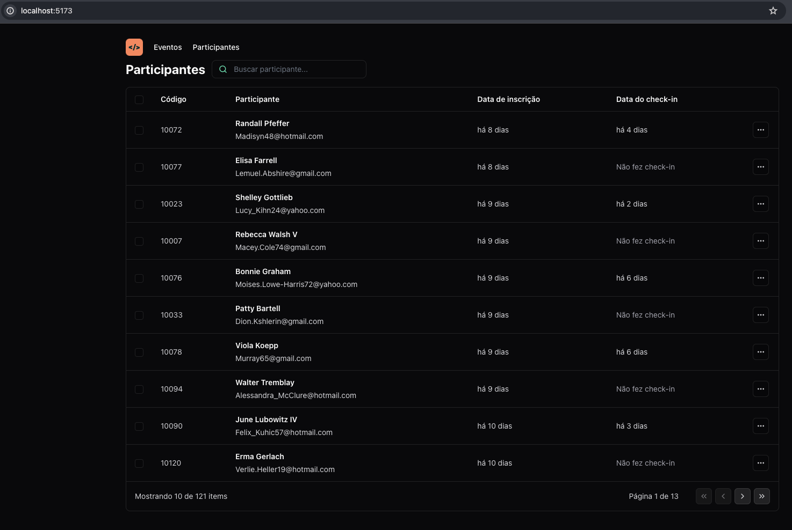
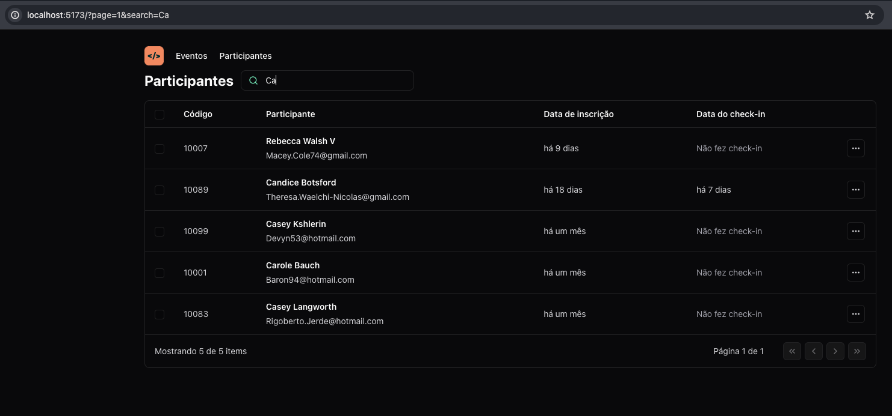

#   Pass-in-web (React)

<br>

## 📝Sobre:
 O projeto foi concebido durante a trilha React do evento NLW-Unite, promovido pela Rocketseat. O Pass.in web é uma aplicação frontend de gestão de participantes em eventos. 
 Ela oferece uma solução abrangente e intuitiva para organizar e gerenciar a presença de participantes em eventos. 

<div style="display: flex; justify-content: space-evenly ;">
    
    
</div>

## 🚀 Como utilizar

### Pré-requisitos

Tenha em sua máquina as seguintes ferramentas:

* [Git](https://git-scm.com)
* [NodeJS](https://nodejs.org/en/)
* [NPM](https://www.npmjs.com/)
* [VSCode](https://code.visualstudio.com/)


### Clonar e executar


**API usada para alimentar dados:**
```bash
# Clone este repositório
$  git clone https://github.com/rocketseat-education/nlw-unite-nodejs.git 

# Instale as dependências
$ npm install

# Crie um arquivo na raiz do projeto chamado ".env" e insira o cmd

DATABASE_URL="file:./dev.db"

# Execute a aplicação em modo de desenvolvimento
$ npm run dev

# Isso irá alimentar Banco de Dados com alguns Dados 
# Inicie o Servidor com o cmd

$ npm run dev
```

**Projeto:**
```bash
# Clone este repositório
$ git clone https://github.com/lucagx/pass-in-react.git

# Acesse a pasta do projeto no terminal
$ cd pass-in-react

# Instale as dependências
$ npm install

# Execute a aplicação em modo de desenvolvimento
$ npm run dev

# A aplicação inciará em alguma porta disponível que poderá ser acessada pelo navegador
```


## 🎨 Layout

Layout do projeto no [Figma](https://www.figma.com/community/file/1356738933008624188/pass-in). 


## 🛠 Tecnologias

Bibliotecas utilizadas no projeto:

- **[TypeScript](https://www.typescriptlang.org/)**
- **[Vite.js](https://vitejs.dev/)**
- **[React.js](https://react.dev/)**
- **[Day.js](https://day.js.org/)**
- **[Lucide-React](https://lucide.dev/guide/packages/lucide-react)**


> Para mais detalhes das libs aplicadas no projeto cheque o arquivo [package.json](./package.json)